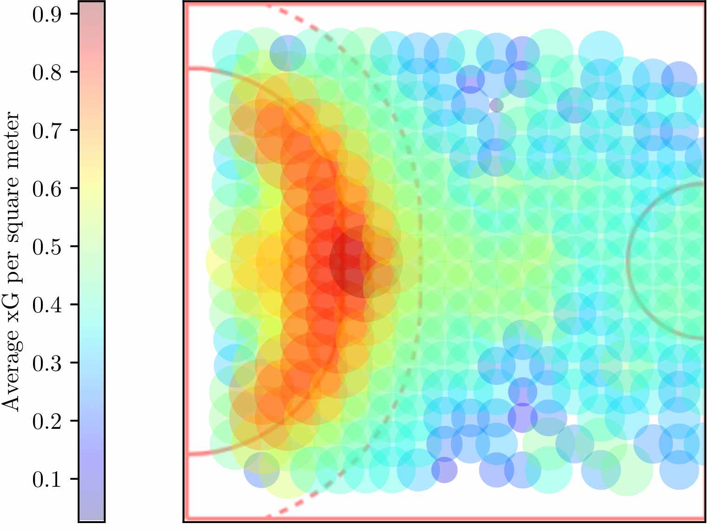

# xG einfach erklaert

## Kurzfassung

xG bedeutet **Expected Goals**, also **erwartete Tore**.

Die Grundidee ist einfach:

- Nicht jeder Wurf ist gleich gut.
- Ein freier Abschluss nahe am Tor ist viel gefaehrlicher als ein bedrängter Wurf aus grosser Distanz.
- xG gibt jedem einzelnen Wurf eine Wahrscheinlichkeit, wie oft daraus im Durchschnitt ein Tor wird.

Beispiel:

- Ein Wurf mit **0.80 xG** wird langfristig in etwa in **80 von 100 Faellen** zum Tor.
- Ein Wurf mit **0.12 xG** wird langfristig nur in etwa in **12 von 100 Faellen** zum Tor.

Wichtig ist: xG sagt **nicht sicher voraus**, ob der naechste Wurf reingeht.
xG beschreibt die **Qualitaet der Chance**.

---

## Ein Bild dazu

Die Grafik zeigt vereinfacht, **aus welchen Bereichen des Feldes Wuerfe im Mittel besonders gefaehrlich sind**.

So kann man sie lesen:

- **Rot / Orange** = hohe durchschnittliche Torwahrscheinlichkeit
- **Gruen / Cyan** = mittlere Torwahrscheinlichkeit
- **Blau / Violett** = eher niedrige Torwahrscheinlichkeit

Die Aussage des Bildes ist klar:

- Abschluesse **nah vor dem Tor** sind im Mittel besonders wertvoll.
- Mit zunehmender **Distanz** und schlechterem **Winkel** sinkt die Torwahrscheinlichkeit.
- xG macht genau diesen Unterschied sichtbar, statt alle Wuerfe gleich zu behandeln.

Das Bild zeigt also anschaulich den Kern von xG:

> **Nicht jeder Wurf ist gleich gefaehrlich.**

---

## Warum braucht man xG?

Ohne xG schaut man oft nur auf einfache Zahlen wie:

- Tore
- Fehlwuerfe
- Wurfquote
- Paraden
- Anzahl der Abschluesse

Diese Zahlen sind nuetzlich, aber sie beantworten oft nicht die wichtigste Frage:

**Wie gut waren die Chancen wirklich?**

Zwei Teams koennen beide 30-mal werfen:

- Team A kommt oft frei aus guter Position zum Abschluss.
- Team B muss viele schwere Wuerfe unter Druck nehmen.

Beide Teams haben gleich viele Wuerfe.
Aber die **Qualitaet** dieser Wuerfe ist sehr verschieden.

xG trennt deshalb:

- **wie viele Chancen** es gab
- **wie gut diese Chancen** waren
- **wie gut oder schlecht** sie verwertet wurden

---

## Einfache Beispiele

### Freier Wurf nach Tempogegenstoss

- nah am Tor
- wenig Druck
- klarer Abschluss

Typisch: **hoher xG-Wert**

### Wurf vom Fluegel

- nah am Tor
- aber oft enger Winkel

Typisch: **mittlerer xG-Wert**

### Rueckraumwurf unter Druck

- groessere Distanz
- schlechtere Position
- moeglicher Blockdruck

Typisch: **niedriger xG-Wert**

---

## Was xG nicht ist

xG ist **nicht**:

- keine sichere Vorhersage fuer den naechsten Wurf
- keine perfekte Wahrheit
- kein Ersatz fuer Videoanalyse
- keine Ausrede nach Niederlagen

xG ist:

- ein Modell fuer **Chancequalitaet**
- ein **Kontextwerkzeug** fuer Wuerfe und Paraden
- eine Hilfe, Leistung fairer einzuordnen

---

## Warum xG im Handball nuetzlich ist

Im Handball gibt es viel mehr Abschluesse und Tore als zum Beispiel im Fussball.
Deshalb ist xG im Handball etwas anders einzuordnen:

- xG ist **sehr hilfreich**, um Wurfqualitaet sichtbar zu machen
- es ist aber **nicht automatisch der eine perfekte Teamstaerke-Messer**
- besonders stark ist xG bei Fragen zu:
  - Wurfqualitaet
  - Spielerprofilen
  - Torhueterkontext
  - Spielstil

Gerade im Handball ist xG daher vor allem ein Werkzeug fuer die Frage:

**Wie gut waren die Abschluesse wirklich?**

---

## Die wichtigste Denkweise in einem Satz

> **Tore sagen, was passiert ist. xG hilft zu verstehen, wie wahrscheinlich es war.**
